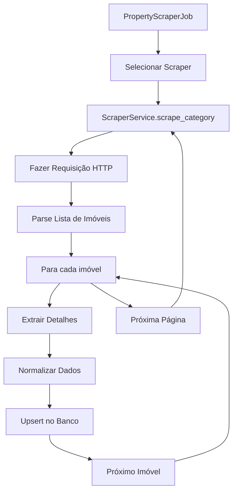
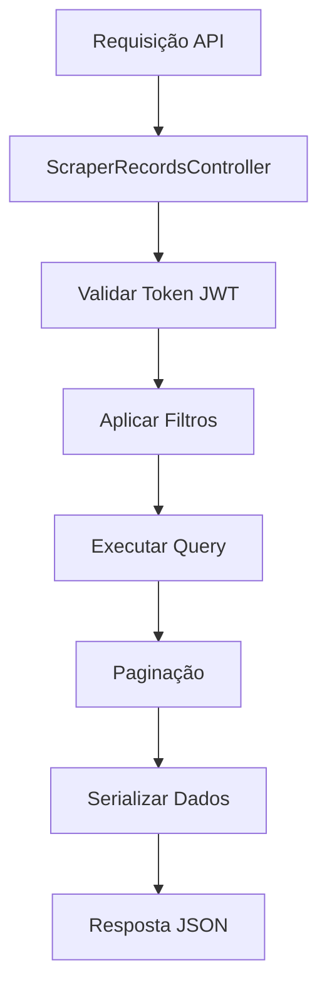
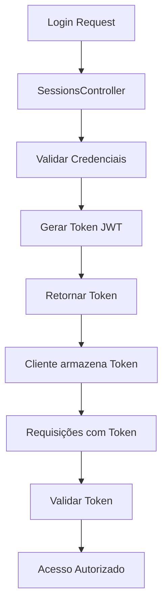

# 🏗️ Arquitetura do Sistema - Sistema de Busca de Imóveis

## Visão Geral da Arquitetura

O sistema foi desenvolvido seguindo os princípios de **Clean Architecture** e **Domain-Driven Design (DDD)**, utilizando Ruby on Rails como framework principal. A arquitetura é modular, escalável e mantém a separação clara de responsabilidades.

## 🎯 Princípios Arquiteturais

### 1. **Separação de Responsabilidades**
- **Controllers**: Gerenciam requisições HTTP e respostas
- **Models**: Representam entidades de negócio e regras de validação
- **Services**: Implementam lógica de negócio complexa
- **Jobs**: Processam tarefas assíncronas
- **Concerns**: Compartilham funcionalidades entre classes

### 2. **Inversão de Dependência**
- Abstrações através de classes base e módulos
- Injeção de dependências via herança e composição
- Interfaces bem definidas entre camadas

### 3. **Single Responsibility Principle**
- Cada classe tem uma responsabilidade específica
- Métodos focados em uma única funcionalidade
- Separação clara entre scraping, parsing e persistência

## 🏛️ Estrutura de Camadas

```
┌─────────────────────────────────────────────────────────────┐
│                    PRESENTATION LAYER                       │
│  ┌─────────────────┐  ┌─────────────────┐  ┌──────────────┐ │
│  │   API Routes    │  │   Controllers   │  │   Serializers│ │
│  │                 │  │                 │  │              │ │
│  └─────────────────┘  └─────────────────┘  └──────────────┘ │
└─────────────────────────────────────────────────────────────┘
                                │
                                ▼
┌─────────────────────────────────────────────────────────────┐
│                     APPLICATION LAYER                       │
│  ┌─────────────────┐  ┌─────────────────┐  ┌──────────────┐ │
│  │   Jobs/Workers  │  │    Services     │  │   Policies   │ │
│  │                 │  │                 │  │              │ │
│  └─────────────────┘  └─────────────────┘  └──────────────┘ │
└─────────────────────────────────────────────────────────────┘
                                │
                                ▼
┌─────────────────────────────────────────────────────────────┐
│                      DOMAIN LAYER                           │
│  ┌─────────────────┐  ┌─────────────────┐  ┌──────────────┐ │
│  │     Models      │  │   Value Objects │  │   Entities   │ │
│  │                 │  │                 │  │              │ │
│  └─────────────────┘  └─────────────────┘  └──────────────┘ │
└─────────────────────────────────────────────────────────────┘
                                │
                                ▼
┌─────────────────────────────────────────────────────────────┐
│                   INFRASTRUCTURE LAYER                      │
│  ┌─────────────────┐  ┌─────────────────┐  ┌──────────────┐ │
│  │   Database      │  │   External APIs │  │   File System│ │
│  │                 │  │                 │  │              │ │
│  └─────────────────┘  └─────────────────┘  └──────────────┘ │
└─────────────────────────────────────────────────────────────┘
```

## 🔧 Componentes Principais

### 1. **Controllers (Presentation Layer)**

#### `Api::V1::ScraperRecordsController`
- **Responsabilidade**: Gerenciar requisições HTTP para imóveis
- **Funcionalidades**:
  - Listagem com filtros e paginação
  - Detalhes de imóvel específico
  - Endpoints auxiliares (sites, categorias)

```ruby
class ScraperRecordsController < BaseController
  before_action :authenticate_api_v1_user!
  
  def index
    # Aplicação de filtros
    # Paginação
    # Serialização de resposta
  end
end
```

#### `Api::V1::Users::SessionsController`
- **Responsabilidade**: Gerenciar autenticação de usuários
- **Funcionalidades**:
  - Login/logout
  - Geração de tokens JWT
  - Validação de credenciais

### 2. **Models (Domain Layer)**

#### `ScraperRecord`
- **Responsabilidade**: Representar entidade de imóvel
- **Validações**:
  - Unicidade por site/código/categoria
  - Validação de categorias e sites permitidos
  - Presença de campos obrigatórios

```ruby
class ScraperRecord < ApplicationRecord
  CATEGORIES = ["Venda", "Locação"].freeze
  SITES = ["solar", "simao", "mws"].freeze
  
  validates :site, presence: true, inclusion: { in: SITES }
  validates :codigo, presence: true, 
                     uniqueness: { scope: [:site, :categoria] }
end
```

#### `User`
- **Responsabilidade**: Gerenciar usuários do sistema
- **Funcionalidades**:
  - Autenticação via Devise
  - Tokens JWT
  - Validações de email e senha

### 3. **Services (Application Layer)**

#### `BaseScraperService`
- **Responsabilidade**: Abstração base para scrapers
- **Funcionalidades**:
  - Template method pattern para scraping
  - Gerenciamento de requisições HTTP
  - Parsing de dados com Nokogiri
  - Controle de rate limiting

```ruby
class BaseScraperService
  def scrape_category(categoria, max_pages: nil, fetch_details: true)
    # Template method para scraping
    # Implementação comum para todos os scrapers
  end
  
  protected
  
  # Métodos abstratos implementados pelas subclasses
  def build_page_url(path, page)
  end
  
  def parse_list(doc, categoria)
  end
end
```

#### Scrapers Específicos
- **`SolarScraperService`**: Scraping do site Solar Imóveis
- **`SimaoScraperService`**: Scraping do site Simão Imóveis  
- **`MwsScraperService`**: Scraping do site MWS

### 4. **Jobs (Application Layer)**

#### `PropertyScraperJob`
- **Responsabilidade**: Processar scraping de forma assíncrona
- **Funcionalidades**:
  - Execução de scrapers em background
  - Upsert de registros no banco
  - Tratamento de erros e retry
  - Logging detalhado

```ruby
class PropertyScraperJob < ApplicationJob
  def perform(scraper_name = :all)
    # Execução de scrapers
    # Processamento de dados
    # Persistência no banco
  end
end
```

### 5. **Parsers (Application Layer)**

#### `BaseCardParser`
- **Responsabilidade**: Extrair dados de elementos HTML
- **Funcionalidades**:
  - Parsing de títulos, preços, localizações
  - Normalização de dados
  - Tratamento de erros de parsing

#### `BasePropertyDetailsExtractor`
- **Responsabilidade**: Extrair detalhes específicos de páginas
- **Funcionalidades**:
  - Parsing de descrições
  - Extração de amenities
  - Coleta de dados adicionais

## 🗄️ Estrutura do Banco de Dados

### Schema Principal

```sql
-- Tabela principal de imóveis
CREATE TABLE scraper_records (
  id BIGSERIAL PRIMARY KEY,
  site VARCHAR NOT NULL,
  categoria VARCHAR,
  codigo VARCHAR NOT NULL,
  titulo VARCHAR,
  localizacao VARCHAR,
  link VARCHAR,
  imagem VARCHAR,
  preco_brl DECIMAL(12,2),
  dormitorios INTEGER,
  suites INTEGER,
  vagas INTEGER,
  area_m2 DECIMAL(10,2),
  condominio DECIMAL(12,2),
  iptu DECIMAL(12,2),
  banheiros INTEGER,
  lavabos INTEGER,
  area_privativa_m2 DECIMAL(10,2),
  mobiliacao VARCHAR,
  amenities JSONB DEFAULT '[]',
  vagas_min INTEGER,
  vagas_max INTEGER,
  descricao TEXT,
  created_at TIMESTAMP NOT NULL,
  updated_at TIMESTAMP NOT NULL
);

-- Índices para performance
CREATE INDEX idx_scraper_records_site_codigo_categoria 
  ON scraper_records (site, codigo, categoria);
CREATE INDEX idx_scraper_records_preco_brl 
  ON scraper_records (preco_brl);
CREATE INDEX idx_scraper_records_localizacao 
  ON scraper_records (localizacao);
CREATE INDEX idx_scraper_records_amenities 
  ON scraper_records USING GIN (amenities);
```

### Relacionamentos

- **Users** → **JWT Tokens** (1:N via Devise)
- **ScraperRecords** → **Independente** (sem relacionamentos diretos)

## 🔄 Fluxos de Dados

### 1. **Fluxo de Scraping**



### 2. **Fluxo de Busca de Imóveis**



### 3. **Fluxo de Autenticação**



## 🚀 Padrões de Design Utilizados

### 1. **Template Method Pattern**
- **Classe**: `BaseScraperService`
- **Propósito**: Definir algoritmo comum de scraping
- **Implementação**: Métodos abstratos nas subclasses

### 2. **Strategy Pattern**
- **Classe**: Diferentes scrapers (Solar, Simão, MWS)
- **Propósito**: Intercambiar algoritmos de scraping
- **Implementação**: Classes com interface comum

### 3. **Factory Pattern**
- **Classe**: `PropertyScraperJob`
- **Propósito**: Criar scrapers dinamicamente
- **Implementação**: Hash de classes por nome

### 4. **Repository Pattern**
- **Classe**: `ScraperRecord`
- **Propósito**: Abstrair acesso aos dados
- **Implementação**: Active Record como repositório

### 5. **Observer Pattern**
- **Classe**: Callbacks do Active Record
- **Propósito**: Executar ações após eventos
- **Implementação**: `before_save`, `after_create`, etc.

## 🔧 Configurações e Inicializações

### 1. **Autenticação JWT**
```ruby
# config/initializers/devise.rb
config.jwt do |jwt|
  jwt.secret = Rails.application.credentials.devise_jwt_secret_key
  jwt.dispatch_requests = [
    ['POST', %r{^/api/v1/users/sign_in$}]
  ]
  jwt.revocation_requests = [
    ['DELETE', %r{^/api/v1/users/sign_out$}]
  ]
end
```

### 2. **CORS**
```ruby
# config/initializers/cors.rb
Rails.application.config.middleware.insert_before 0, Rack::Cors do
  allow do
    origins '*'
    resource '*', headers: :any, methods: [:get, :post, :put, :patch, :delete, :options, :head]
  end
end
```

### 3. **Background Jobs**
```ruby
# config/application.rb
config.active_job.queue_adapter = :sidekiq
```

## 📊 Monitoramento e Logs

### 1. **Estrutura de Logs**
- **Development**: Log detalhado com SQL queries
- **Production**: Log estruturado para análise
- **Scraping**: Logs específicos para jobs

### 2. **Métricas Importantes**
- **Performance**: Tempo de resposta da API
- **Scraping**: Sucesso/falha por site
- **Erros**: Rate de erros por endpoint
- **Usuários**: Atividade de autenticação

### 3. **Health Checks**
```ruby
# app/controllers/api/health_controller.rb
def index
  render json: {
    status: 'ok',
    timestamp: Time.current,
    version: Rails.application.class.parent::VERSION
  }
end
```

## 🔒 Segurança

### 1. **Autenticação**
- JWT com expiração configurável
- Tokens revogáveis via blacklist
- Senhas hasheadas com bcrypt

### 2. **Autorização**
- Middleware de autenticação em controllers
- Validação de tokens em todas as requisições protegidas
- Rate limiting por usuário

### 3. **Validação de Dados**
- Sanitização de inputs
- Validação de tipos de dados
- Escape de SQL injection (Active Record)

### 4. **Web Scraping**
- Rate limiting respeitoso
- User-Agent identificável
- Tratamento de erros de rede
- Timeout configurável

## 🚀 Escalabilidade

### 1. **Horizontal Scaling**
- Stateless API (sem sessões no servidor)
- Load balancer ready
- Database connection pooling

### 2. **Vertical Scaling**
- Índices otimizados no banco
- Cache de queries frequentes
- Background job processing

### 3. **Performance**
- Paginação em todas as listagens
- Índices GIN para campos JSON
- Lazy loading de relacionamentos

## 🔮 Extensibilidade

### 1. **Novos Scrapers**
- Implementar `BaseScraperService`
- Adicionar ao hash de scrapers
- Configurar paths e seletores CSS

### 2. **Novos Filtros**
- Estender query builder
- Adicionar validações
- Documentar na API

### 3. **Novos Endpoints**
- Seguir padrão REST
- Implementar serializers
- Adicionar testes

---

**Esta documentação é mantida atualizada conforme a evolução do sistema.**
